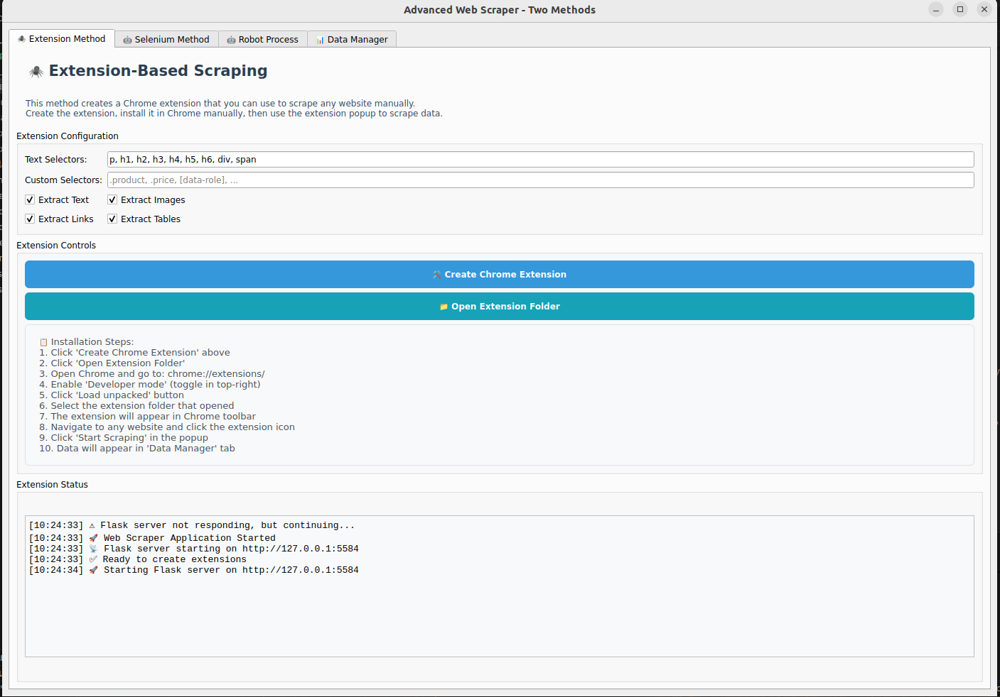
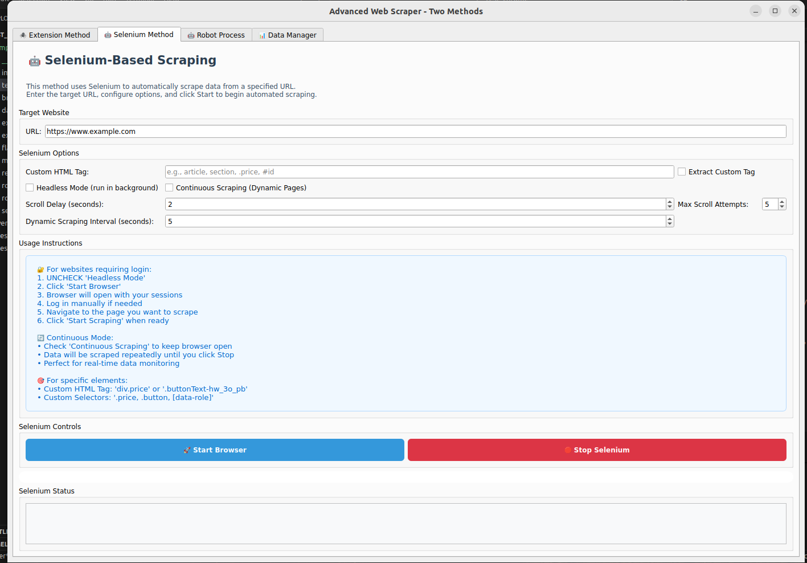
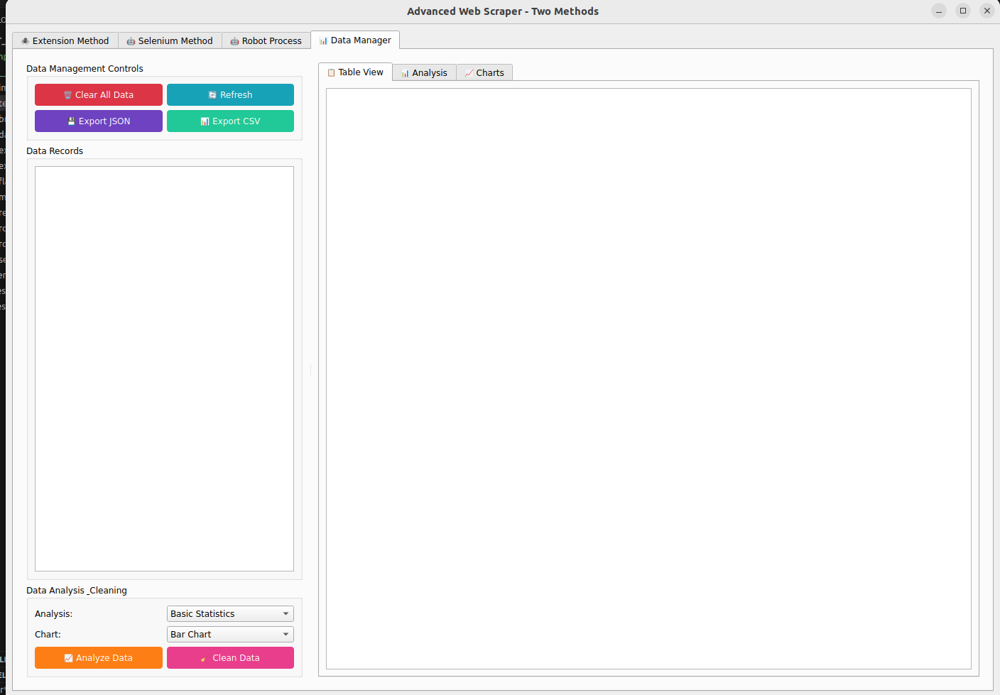

# Data Scraper Tools

A powerful Chrome Extension and Selenium-based automation tool that extracts real-time data from any website using HTML classes and IDs, automatically saving the data in structured JSON files.






## Features

- **Chrome Extension**: Extract data directly from browser with point-and-click interface
- **Selenium Automation**: Programmatic web scraping with full browser control
- **Real-time Data Extraction**: Capture live data from any website
- **HTML Class & ID Targeting**: Precisely target elements using CSS selectors
- **Structured JSON Output**: Automatically save data in organized JSON format
- **Cross-Platform**: Works on Windows, macOS, and Linux

## Installation

### Prerequisites

- Python 3.7 or higher
- Google Chrome browser
- Node.js (for Chrome Extension development)

### Step 1: Install Python Dependencies

```bash
# Install all required libraries from requirements.txt
pip install -r requirements.txt
